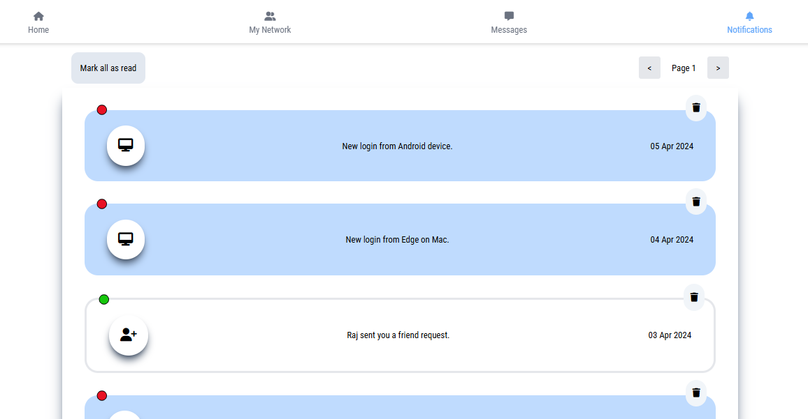

# HuntYourTribe_Assignment
This project is a Notification System developed using React, Tailwind CSS, Flask, and MariaDB. It allows users to view, manage, and interact with notifications in a clean and responsive interface.

# Features
* Display notifications with appropriate icons and messages.

* Pagination to navigate through notification pages.

* Mark individual notifications as "read".

* "Mark all as read" button for bulk updates.

* Delete individual notifications.

* Uses Font Awesome icons for better visual representation.

# Technologies Used
### Frontend:

* React JS

* Tailwind CSS

### Backend:

* Python Flask (REST API)

### Database:

* MariaDB (MySQL-compatible)

# Notification Types & Icons
The application supports multiple notification types, each with a relevant Font Awesome icon:

* Friend Request Received - fa-solid fa-user-plus

* Login from new device - fa-solid fa-desktop

* Someone liked your post - fa-solid fa-thumbs-up

* Someone commented - fa-solid fa-comment

* New message received - fa-solid fa-message

* New post from user - fa-solid fa-pen-to-square

These icon classes are stored in the database and dynamically loaded in the UI.

# How It Works
* Notifications are fetched from the backend using a REST API.

* Users can perform actions like marking as read, deleting, or viewing details.

* The backend updates the MariaDB table accordingly.

* The frontend displays these notifications in a styled card layout.

* Messages that are too long are automatically truncated with a “...” to maintain design consistency.

# Running the Project
### Backend (Flask):

* Install dependencies: pip install -r requirements.txt

* Start server: python app.py

* Server will run on http://localhost:5000

### Frontend (React + Vite):

* Install dependencies: npm install

* Start dev server: npm run dev

* App runs at http://localhost:5173

Make sure your backend and frontend ports match your fetch requests.

### Database Details
MariaDB Table: notification_table

Columns:

* id – Primary Key

* icon – Font Awesome class

* message – Notification content

* is_read – Boolean (0 = unread, 1 = read)

* created_at – Timestamp of the notification

# Future Improvements
* Add user authentication and login session support.

* Real-time notifications using WebSockets.

* Add read/unread filters.

* Categories or tabs for different types of notifications.

# Output

# Conclusion
Thus, the Notification System is successfully developed and is working as expected.